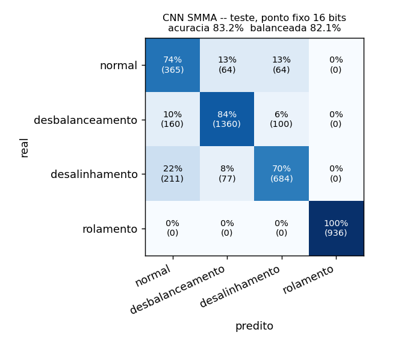

# CI-DIGITAL--SMMA-ACELERCADOR-FPGA-PARA-MANUTENCAO-PREDITIVA
Acelerador Digital para Monitoramento Inteligente de Máquinas Industriais

Este README cobre o **acelerador CNN** do SMMA e, principalmente, **como a rede foi
treinada em Python e como os pesos treinados chegam à ROM do hardware**.
Os módulos RTL em si estão documentados nos cabeçalhos de cada arquivo `.v`.

---

## Sumário
1. [Visão geral](#1-visão-geral)
2. [Estrutura do repositório](#2-estrutura-do-repositório)
3. [O que já foi rodado e o que você precisa rodar](#3-o-que-já-foi-rodado-e-o-que-você-precisa-rodar)
4. [Instalação](#4-instalação)
5. [Como testar a CNN (simulação)](#5-como-testar-a-cnn-simulação)
6. [Como refazer o treinamento](#6-como-refazer-o-treinamento)
7. [A lógica do treinamento, passo a passo](#7-a-lógica-do-treinamento-passo-a-passo)
8. [Resultados](#8-resultados)
9. [Limitações e próximos passos](#9-limitações-e-próximos-passos)

---

## 1. Visão geral

O enunciado do PBL pede uma CNN em hardware que receba um **espectrograma 32×32×1**
de vibração e classifique o motor em **normal, desbalanceamento, desalinhamento ou
desgaste de rolamento**. O hardware (pasta `RTL/`) faz só a **inferência**; os pesos
precisam vir de um **treinamento offline**, feito em Python. O fluxo completo é:

```
 dataset (CSV, 9.7 GB)
   │  01  converte para .npy (só o acelerômetro usado)
   ▼
 sinais brutos .npy
   │  02  filtra, decima, FFT de 64 pts a cada 10 ms -> espectrogramas 32x32 (Q1.15)
   ▼
 dataset.npz  (treino / validação / teste)
   │  03  treina em PyTorch a MESMA rede do RTL, respeitando o ponto fixo
   ▼
 pesos inteiros Q1.15 (pesos_16b.npz)
   │  04  mede a acurácia bit-exata (= FPGA), compara 16/8/4 bits
   │  05  gera a ROM e os vetores de teste
   ▼
 RTL/CNN_Weight_ROM.v + RTL/golden_model.py + RTL/vetores/*.hex
   │      simulação (testbenches)
   ▼
 hardware conferido bit a bit contra o Python
```

---

## 2. Estrutura do repositório

```
├── RTL/                          # hardware (Verilog) + testbenches
│   ├── CNN_*.v                   # módulos da CNN
│   ├── CNN_Weight_ROM.v          # <- GERADO pelo passo 05 (pesos treinados)
│   ├── golden_model.py           # <- constantes GERADAS pelo passo 05
│   ├── vetores/                  # <- GERADO pelo passo 05 (valores esperados dos testbenches)
│   ├── tb_CNN_*.v                # testbenches
│   ├── run_all_cnn.sh            # roda todos os testbenches (Icarus Verilog)
│   ├── gerar_png_espectrogramas.py  # figuras das imagens do tb_CNN_Top
│   └── espectrogramas_teste/     # <- GERADO ao rodar o tb_CNN_Top (PNGs)
│
├── python/                       # treinamento
│   ├── config.py                 # TODOS os parâmetros do fluxo
│   ├── requirements.txt
│   ├── smma/
│   │   ├── espectrograma.py      # sinal -> espectrograma 32x32 (especificação do hardware)
│   │   ├── modelo.py             # a CNN do RTL em PyTorch
│   │   └── golden.py             # modelo bit-exato do RTL (vetorizado)
│   ├── scripts/
│   │   ├── 01_converter_csv.py
│   │   ├── 02_gerar_espectrogramas.py
│   │   ├── 03_treinar.py
│   │   ├── 04_avaliar_ponto_fixo.py
│   │   └── 05_exportar_rtl.py
│   └── resultados/               # pesos treinados, logs, relatório, matriz de confusão
│
└── dados/                        # NÃO vai para o git (ver .gitignore)
    ├── Dataset - vibração/*.csv  # dataset original (45 arquivos, 9.7 GB)
    ├── artigo/                   # artigo do dataset (Jung et al., 2023)
    └── processado/               # gerado pelos passos 01 e 02
        ├── brutos/*.npy          # ~1 GB
        └── espectrogramas/dataset.npz   # ~23 MB
```

---

## 3. O que já foi rodado e o que você precisa rodar

| Passo | Script | Status | Precisa rodar? |
|---|---|---|---|
| 01 | `01_converter_csv.py` | ✅ rodado (saída em `dados/processado/brutos/`) | **Não.** Só se apagar a pasta `processado/` ou trocar o dataset. |
| 02 | `02_gerar_espectrogramas.py` | ✅ rodado (saída em `dados/processado/espectrogramas/dataset.npz`) | **Não.** Só se mudar algo do espectrograma no `config.py` (canal, escala, divisão...). |
| 03 | `03_treinar.py` (16, 8 e 4 bits) | ✅ rodado (pesos em `python/resultados/`) | **Não.** Só para retreinar ou experimentar. |
| 04 | `04_avaliar_ponto_fixo.py` | ✅ rodado (`python/resultados/relatorio.md` e `matriz_confusao.png`) | **Não.** Rode de novo sempre que retreinar. |
| 05 | `05_exportar_rtl.py` | ✅ rodado (ROM, golden model e `RTL/vetores/` já atualizados) | **Não.** Rode de novo sempre que retreinar. |
| — | `RTL/run_all_cnn.sh` | ✅ 9/9 testbenches passando | **Sim, para testar** (é o único passo necessário para verificar a CNN). |

> Os passos 01 e 02 foram rodados no computador do projeto. Os passos 03–05 foram
> rodados em outro ambiente com PyTorch, e os resultados foram copiados para o
> repositório. **Para apenas testar a CNN com os pesos treinados, basta a seção 5.**

**Se mudar alguma coisa, rode a partir do passo afetado:**

| Mudou... | Rode a partir de |
|---|---|
| o dataset (CSVs) | 01 |
| canal, FFT, escala, divisão treino/teste (`config.py`) | 02 |
| hiperparâmetros do treino, número de bits | 03 |
| só quer o relatório de novo | 04 |
| quer gravar outro modelo na ROM (ex.: 8 bits) | 05 |

Depois de rodar o passo 05, rode os testbenches de novo: eles leem os valores
esperados que o passo 05 acabou de gerar, então **nenhum testbench precisa ser
editado à mão**.

---

## 4. Instalação

- **Python 3.9+** com:
  ```bash
  pip install -r python/requirements.txt
  ```
  `numpy` basta para os passos 01 e 02. O treino (03–05) precisa de `torch`
  (versão CPU é suficiente) e, opcionalmente, `matplotlib` para a figura.
- **Icarus Verilog** para as simulações (no Windows: instalador do Icarus + Git Bash, ou WSL).

Todos os comandos abaixo são rodados **a partir da raiz do repositório**
(no Windows troque `/` por `\` nos caminhos dos scripts Python).

---

## 5. Como testar a CNN (simulação)

```bash
cd RTL
./run_all_cnn.sh              # os 9 testbenches
./run_all_cnn.sh CNN_Top      # só o teste de sistema
```

Saída esperada no final:
```
# RESUMO DA SUITE:  9 modulo(s) OK, 0 com falha
```

O que cada teste dependente dos pesos confere:

| Testbench | O que verifica | Valores esperados vêm de |
|---|---|---|
| `tb_CNN_Weight_ROM` | os 116 pesos da ROM (72 conv + 8 bias + 32 densa + 4 bias) | `vetores/rom_pesos.hex` |
| `tb_CNN_Conv_Layer` | 4 janelas 3x3 (uniforme, impulso, rampa, negativa) | `vetores/conv_esperado.hex` |
| `tb_CNN_Dense_Classifier` | GAP + densa + argmax com 3 vetores de features | `vetores/dense_esperado.hex` |
| `tb_CNN_Top` | **8 espectrogramas reais** do conjunto de teste, 2 por classe | `vetores/top_imagens.hex`, `vetores/top_esperado.hex` |

**Figuras dos espectrogramas:** depois do `tb_CNN_Top`, o `run_all_cnn.sh` chama o
`RTL/gerar_png_espectrogramas.py`, que gera em **`RTL/espectrogramas_teste/`** uma
figura por imagem (espectrograma + os 4 scores que o hardware calculou, com
acertou/errou) e o `painel_todas.png` com as 8 lado a lado. A resposta do hardware
vem de `RTL/sim_out/top_saida_hw.txt`, gravado pelo próprio testbench. Precisa de
`numpy` e `matplotlib`; se rodar a simulação sem o script (ex.: pelo PowerShell),
gere as figuras depois com `python gerar_png_espectrogramas.py` dentro de `RTL/`.

O `tb_CNN_Top` **passa** quando o hardware reproduz o modelo Python **bit a bit**
(8 features, 4 scores e a classe). Além disso ele imprime se a rede acertou o
diagnóstico real de cada imagem (informativo — a rede não é 100% precisa) e mede
os ciclos por imagem (≈ 9 300 ciclos = 185 µs a 50 MHz, folga de 54× sobre os 10 ms).
A origem de cada imagem está em `RTL/vetores/top_origem.txt`.

> **Windows:** rode o `run_all_cnn.sh` pelo **Git Bash** (`bash run_all_cnn.sh CNN_Top`).
> No PowerShell, `./run_all_cnn.sh` não executa o script. Alternativa no PowerShell, dentro de `RTL/`:
> `iverilog -g2005 -o top.vvp -s tb_CNN_Top tb_CNN_Top.v CNN_MAC_Unit.v CNN_ReLU.v CNN_Weight_ROM.v CNN_Line_Buffer.v CNN_Conv_Layer.v CNN_MaxPool.v CNN_Dense_Classifier.v CNN_Control_FSM.v CNN_Top.v`
> e depois `vvp top.vvp`.

> **ModelSim/Questa pelo Quartus:** os testbenches usam `$readmemh("vetores/...")`,
> caminho relativo à pasta onde o simulador roda. O Quartus roda em
> `simulation/modelsim/`; copie a pasta `RTL/vetores/` para lá.

**Para ver um espectrograma** (o `.npz` não abre com duplo clique):
```python
import numpy as np, matplotlib.pyplot as plt
d = np.load("dados/processado/espectrogramas/dataset.npz")
i = 0
plt.imshow(d["X_teste"][i], origin="lower", aspect="auto", cmap="magma")
plt.title(f"classe {d['y_teste'][i]} - {d['arquivos'][d['g_teste'][i]]}")
plt.xlabel("tempo (FFTs de 10 ms)"); plt.ylabel("bin (50 Hz cada)"); plt.show()
```

---

## 6. Como refazer o treinamento

```bash
python python/scripts/01_converter_csv.py          # ~3 min   (só uma vez)
python python/scripts/02_gerar_espectrogramas.py   # ~40 s
python python/scripts/03_treinar.py                # ~4 min   (16 bits: o que vai para a ROM)
python python/scripts/03_treinar.py --bits 8       # opcional: estudo de quantização
python python/scripts/03_treinar.py --bits 4       # opcional
python python/scripts/04_avaliar_ponto_fixo.py     # ~1 min   -> resultados/relatorio.md
python python/scripts/05_exportar_rtl.py           # segundos -> ROM + vetores de teste
cd RTL && ./run_all_cnn.sh                         # confere o hardware
```

- `05_exportar_rtl.py --bits 8` grava na ROM a versão treinada para 8 bits.
- `03_treinar.py` aceita `--epocas`, `--lr`, `--temperatura`, `--semente`.
- O resultado de um retreino pode variar um pouco (outro computador, outra versão
  do PyTorch). Isso não é problema: os passos 04 e 05 recalculam tudo a partir dos
  pesos novos, e os testbenches continuam batendo.

---

## 7. A lógica do treinamento, passo a passo

### 7.1 Por que o treino é em Python e não no chip
Treinar exige calcular gradientes (*backpropagation*), guardar ativações
intermediárias e atualizar pesos milhares de vezes — caro em lógica e memória e
ruim em ponto fixo de 16 bits. O treino acontece **uma vez**; a inferência acontece
o tempo todo. Por isso o hardware só faz a inferência, e os pesos treinados ficam
gravados em uma ROM. O desafio é garantir que **a rede treinada em Python calcule
exatamente o que o hardware calcula** — todo o fluxo abaixo é construído em torno disso.

### 7.2 O dataset
*Jung et al., "Vibration, acoustic, temperature, and motor current dataset of
rotating machine under varying operating conditions for fault diagnosis",
Data in Brief 48 (2023) 109049* — KAIST (artigo em `dados/artigo/`).

- Bancada: motor de 3 HP, eixo a **3010 RPM (50,17 Hz)**, dois mancais (A e B), 3 cargas (0, 2 e 4 Nm).
- 4 acelerômetros a **25,6 kHz**: `Canal1` = x do mancal A, `Canal2` = y do A, `Canal3`/`Canal4` = x/y do B.
- **Todas as falhas foram inseridas junto ao mancal A.**
- 45 arquivos = 3 cargas × 15 condições, agrupados nas 4 classes do enunciado:

| Classe (índice na ROM) | Arquivos | Duração total |
|---|---|---|
| 0 normal | `*_Normal` | ~540 s |
| 1 desbalanceamento | `*_Unbalance_*` (583 a 3318 mg) | ~1800 s |
| 2 desalinhamento | `*_Misalign_*` (0,1 / 0,3 / 0,5 mm) | ~1080 s |
| 3 desgaste de rolamento | `*_BPFI_*` + `*_BPFO_*` (trincas de 0,3 / 1,0 / 3,0 mm) | ~540 s |

**Canal escolhido: `Canal1` (x do mancal A).** Comparando os canais, o pico na
rotação (bin de 50 Hz), que denuncia o desbalanceamento, cresce com a massa no eixo
x, mas quase não muda no y. Com o `Canal2` a rede não separava desbalanceamento de normal.

### 7.3 Passo 01 — CSV para .npy
Os CSVs são texto (9,7 GB) e lentos de ler. O script lê em blocos de 1 milhão de
linhas (pouca RAM), guarda só `Canal1` e `Canal2` em `float32` e grava um `.npy`
por arquivo (~1 GB no total). A gravação é atômica: se for interrompido, basta
rodar de novo que ele continua de onde parou.

### 7.4 Passo 02 — do sinal ao espectrograma (`smma/espectrograma.py`)
Este arquivo é a **especificação do bloco FFT → espectrograma do hardware**. Cada
etapa foi escolhida para respeitar o enunciado e ser implementável em FPGA:

| Etapa | O que faz | Por quê |
|---|---|---|
| 1. Escala do sensor | `x_q = sat(x[g] / 32)` em Q1.15 | ±32 g = ±1,0; as falhas mais fortes chegam a ~12 g RMS |
| 2. FIR anti-aliasing | passa-baixa de 63 taps, corte 1,4 kHz, coeficientes Q1.15 | evita *aliasing* na decimação |
| 3. Decimação ×8 | 25,6 kHz → **3,2 kHz** | com FFT de 64 pontos, cada bin vale **50 Hz**: a rotação cai no bin 1 e os harmônicos em bins inteiros (bom também para o módulo MDC) |
| 4. FFT de 64 pontos | janela retangular, **nova FFT a cada 32 amostras = 10 ms** | o enunciado pede FFT de 64 pts e uma janela a cada 10 ms; saída dividida por 16 (escala em 4 dos 6 estágios radix-2; o pico máximo medido ficou em ~43% do fundo de escala) |
| 5. Magnitude | `|X|` dos bins 0..31 (0 a 1550 Hz) | o bin 32 (Nyquist) é descartado → exatamente 32 linhas |
| 6. Compressão log | `log2(|X|+1)` pela **aproximação de Mitchell**: `e = posição do 1 mais significativo`, `pixel = e·2048 + ((m − 2^e) << 11) >> e` | as amplitudes variam mais de 100×; o log equaliza. Em hardware é só um *priority encoder* + deslocamento |
| 7. Imagem | 32 FFTs consecutivas → matriz 32×32 (**linha = frequência, coluna = tempo**, 320 ms) | entrada 32×32×1 do enunciado; entra no `CNN_Top` em ordem raster |

**Divisão treino / validação / teste — por tempo, dentro de cada arquivo:**
primeiros 70% → treino, próximos 15% → validação, últimos 15% → teste, com 0,5 s
descartado entre as fatias. Imagens vizinhas compartilham amostras e são quase
idênticas; sortear as imagens colocaria "a mesma" imagem no treino e no teste e
inflaria a acurácia. Assim, **nenhuma imagem de teste tem amostras vistas no treino**.

Resultado: 27 649 imagens (19 607 treino, 4 021 validação, 4 021 teste), com uma
nova imagem a cada 16 FFTs (160 ms) dentro de cada fatia.

### 7.5 Passo 03 — a rede em PyTorch (`smma/modelo.py`)
A rede em PyTorch é **camada por camada a mesma do RTL**:

| PyTorch | Dimensão | Módulo RTL equivalente |
|---|---|---|
| entrada = pixel / 32768 | 32×32×1 | `CNN_Top` (`in_pixel`) |
| `Conv2d(1, 8, 3, stride=1, padding=1)` + bias | 32×32×8 | `CNN_Line_Buffer` + `CNN_Conv_Layer` + `CNN_MAC_Unit` |
| saturação em [−1, 1) e ReLU | 32×32×8 | `CNN_ReLU` |
| `max_pool2d(2)` | 16×16×8 | `CNN_MaxPool` |
| média global (GAP) | 8 | `CNN_Dense_Classifier` (acumula e faz `>> 8`) |
| `Linear(8, 4)` + bias, saturado em [−1, 1) | 4 scores | `CNN_Dense_Classifier` |
| `argmax` | classe | `CNN_Dense_Classifier` |

São apenas **116 parâmetros**: 8×9 pesos + 8 bias na convolução, 4×8 pesos + 4 bias na densa.

**Restrições do hardware aplicadas durante o treino** — é isso que faz os pesos
treinados funcionarem na ROM sem surpresas:

1. **Faixa do Q1.15.** Depois de cada passo do otimizador, todos os parâmetros são
   limitados a [−1, 1 − 2⁻¹⁵] (`limita()`), que é tudo o que cabe em 16 bits Q1.15.
2. **Quantização simulada (*fake quantization*).** No *forward*, os pesos são
   arredondados para a grade do formato de destino (16, 8 ou 4 bits) antes de serem
   usados; no *backward* o gradiente passa direto, como se o arredondamento não
   existisse (*straight-through estimator*). A rede aprende já sabendo que seus
   pesos serão arredondados — isso é o **treino ciente da quantização (QAT)**.
3. **Saturação igual à do hardware.** O hardware satura a saída da convolução e os
   scores em 16 bits; o modelo faz `clamp` nos mesmos pontos.
4. **ReLU com gradiente "vazado" só no treino.** O *forward* usa a ReLU+saturação
   exata do hardware. No *backward*, onde a ReLU cortou, deixa passar 5% do
   gradiente (`relu_sat`). Isso tenta evitar filtros "mortos" (que nunca ativam)
   **sem mudar em nada o que o hardware calcula**.
5. **Inicialização** com pesos pequenos e bias positivo, para que todas as ReLUs comecem ativas.

**Como a perda é calculada:**
- Os scores ficam em [−1, 1); antes do *softmax* eles são multiplicados por uma
  **temperatura** (32), senão as probabilidades ficam todas parecidas e o gradiente some.
- *Cross-entropy* **ponderada pelo inverso da frequência da classe**: há 3× mais
  imagens de desbalanceamento do que de normal; sem o peso, a rede tenderia a chutar a classe maior.
- Otimizador Adam, lr 0,01 com decaimento cosseno, 60 épocas, lotes de 128.

**Como o melhor modelo é escolhido:** ao fim de cada época, os pesos são
convertidos para inteiros Q1.15 e avaliados no conjunto de **validação** pelo
**modelo bit-exato** (`smma/golden.py`). Guarda-se a época com maior **acurácia
balanceada** (média do acerto de cada classe). Ou seja, o modelo escolhido é o
melhor **no hardware**, não no float.

Saídas: `resultados/modelo_<bits>b.pt` (float), `resultados/pesos_<bits>b.npz`
(inteiros prontos para a ROM) e `resultados/treino_<bits>b.log`.

### 7.6 Os dois modelos de referência (*golden models*)
Um *golden model* é um programa que faz **exatamente as mesmas contas inteiras que o
RTL**: produtos de 16×16 bits, acumuladores largos, arredondamento `(acc + 2^14) >> 15`,
saturação em 16 bits, ReLU, max pooling, GAP por `>> 8`, densa e argmax (empate → menor índice).

- `RTL/golden_model.py` — versão original, imagem por imagem, fácil de ler. É a
  referência usada para gerar os valores esperados dos testbenches.
- `python/smma/golden.py` — a mesma conta vetorizada com numpy, para avaliar
  milhares de imagens em segundos (usada no treino e na avaliação).

O passo 05 confere que os dois dão **o mesmo resultado** antes de gerar os vetores.

### 7.7 Passo 04 — avaliação (`04_avaliar_ponto_fixo.py`)
No conjunto de **teste** (nunca usado para treinar nem para escolher o modelo), calcula:
- acurácia em float × acurácia bit-exata em ponto fixo (o que o FPGA vai ter);
- 16, 8 e 4 bits: com treino ciente (QAT) e só arredondando o modelo de 16 bits (PTQ);
- matriz de confusão, acerto por arquivo (severidade × carga) e por carga.

Gera `resultados/relatorio.md` e `resultados/matriz_confusao.png`. A análise
escrita está em `resultados/ANALISE.md`.

### 7.8 Passo 05 — dos pesos para a ROM (`05_exportar_rtl.py`)
Lê `resultados/pesos_16b.npz` (inteiros Q1.15) e gera:

**`RTL/CNN_Weight_ROM.v`** — reescrito por completo, com **a mesma interface e
organização** de antes. A convolução processa 1 tap por ciclo com os 8 filtros em
paralelo, então a ROM é organizada **por tap**: o endereço `t` (0..8, `t = linha·3 + coluna`)
devolve os 8 pesos daquele tap numa palavra de 128 bits `{F7, …, F0}`:
```verilog
4'd0: conv_w = {  -16'sd32737,  -16'sd11103,  16'sd989, ... ,  -16'sd12872 };  // tap 0 de F7..F0
```
A densa usa endereço `classe·8 + feature`. A codificação é `inteiro = real × 32768`.

**`RTL/golden_model.py`** — só as listas `KER`, `BIAS`, `DENSE_W` e `DENSE_B` são
substituídas; as funções continuam as mesmas.

**`RTL/vetores/*.hex`** — valores esperados dos testbenches, em hexadecimal de 16
bits (complemento de 2), um por linha, lidos com `$readmemh`:

| Arquivo | Conteúdo |
|---|---|
| `rom_pesos.hex` | os 116 pesos na ordem: conv (filtro·9 + tap), bias conv, densa (classe·8 + feature), bias densa |
| `conv_esperado.hex` | saída dos 8 filtros para 4 janelas de teste |
| `dense_esperado.hex` | 3 testes × (8 features, 4 scores, classe) |
| `top_imagens.hex` | 8 espectrogramas reais do teste (2 por classe, sorteio fixo), 1024 pixels cada |
| `top_esperado.hex` | por imagem: 8 features, 4 scores, classe esperada, classe real |
| `top_origem.txt` | de qual arquivo/condição veio cada imagem |

Com isso, **retreinar não exige editar nenhum arquivo à mão**: passo 05 → testbenches.

---

## 8. Resultados

Modelo de 16 bits gravado na ROM, conjunto de **teste** (4 021 imagens), ponto
fixo bit-exato (= FPGA):

- **Acurácia 83,2 %** (balanceada 82,1 %). Float e ponto fixo discordam em só 0,02 % das imagens.
- **Rolamento: 100 %** em todas as severidades e cargas.
- Desbalanceamento: 84 % (≥ 1751 mg: 89–100 %; 583 mg: 46–70 %).
- Desalinhamento: 70 % (0,3–0,5 mm ≈ 100 %, exceto 4 Nm/0,3 mm; 0,1 mm: 8–48 %).
- Normal: 74 % (0 Nm: 93 %; 4 Nm: 25 %).



**Quantização (diferencial da seção 9 do enunciado):**

| Pesos | Acurácia (teste, ponto fixo) |
|---|---|
| 16 bits | 83,2 % |
| 8 bits (arredondando o de 16) | 83,3 % — mesma acurácia com metade dos bits |
| 8 bits (QAT) | 81,3 % |
| 4 bits (arredondando) | 68,7 % |
| 4 bits (QAT) | 70,2 % |

Detalhes por arquivo e por carga em `python/resultados/relatorio.md`.

---

## 9. Limitações e próximos passos

- **A camada GAP é o gargalo.** A média global descarta *em que frequência* está a
  energia — e é isso que separa desbalanceamento (pico na rotação) do normal. Por
  isso, 4 dos 8 filtros terminam sem uso (feature sempre 0). Mantendo a mesma
  convolução do enunciado e trocando só a classificação (validação, float):

  | Classificação | Pesos na densa | Acurácia balanceada |
  |---|---|---|
  | GAP → densa 8×4 (**atual**) | 32 | ~80 % |
  | média só no tempo → densa 128×4 | 512 | 93,7 % |
  | mapa inteiro → densa 2048×4 | 8 192 | 95,1 % |

  A "média só no tempo" exigiria alterar o `CNN_Dense_Classifier.v`.
- **Falhas leves** (desalinhamento 0,1 mm, desbalanceamento 583 mg) têm espectro
  quase igual ao normal com FFT de 64 pontos (1 volta do eixo por FFT). Uma FFT
  maior (256 pts) melhoraria a resolução — é a pergunta 7.1 do enunciado.
- **O bloco espectrograma ainda não existe em hardware.** O hardware de FFT/espectrograma
  precisa seguir `python/smma/espectrograma.py` para que a CNN receba o mesmo tipo de
  imagem que viu no treino.
- **Demonstração na placa:** falta um *wrapper* de topo com espectrogramas reais em
  memória (podem vir de `RTL/vetores/top_imagens.hex`), botão de `start` e a classe
  em LEDs/display.
