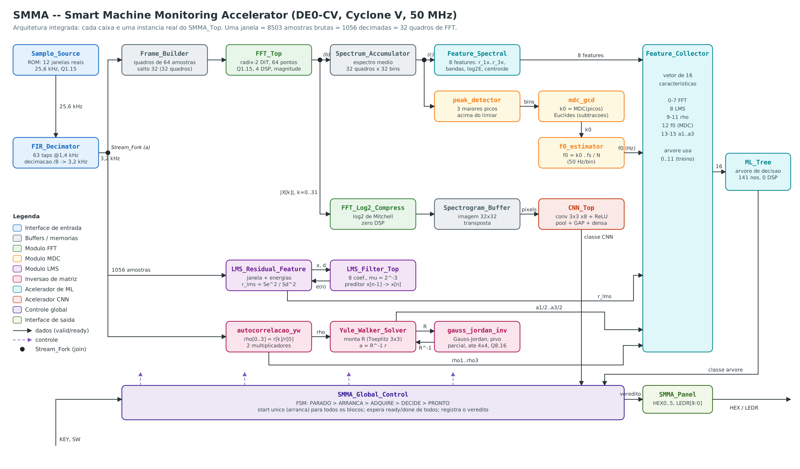

# SMMA — Arquitetura final e relação dos módulos

**Smart Machine Monitoring Accelerator** — acelerador digital para manutenção
preditiva de motores elétricos, descrito em Verilog e implementado na
**Terasic DE0-CV** (Cyclone V `5CEBA4F23C7N`, 50 MHz).



(versões vetoriais: [SVG](diagramas/SMMA_arquitetura.svg) · [PDF](diagramas/SMMA_arquitetura.pdf))

---

## 1. Relação: módulos pedidos no enunciado × módulos no projeto

Cada item da arquitetura geral exigida (enunciado, seção 4) é **uma instância
real dentro do `SMMA_Top`** — nenhum módulo das branches foi absorvido por
outro código.

| Requisito do enunciado | Seção | Módulo(s) no RTL | Pasta | Origem |
|---|---|---|---|---|
| Interface de entrada dos sensores | 4 | `Sample_Source` (sensor emulado: 12 janelas reais em ROM, 25,6 kHz) + `FIR_Decimator` (anti-alias 63 taps, ÷8) | `RTL/entrada` | integração |
| Memória / buffers de amostras | 4 | `Frame_Builder` (quadros de 64, salto 32), `Spectrum_Accumulator` (espectros dos 32 quadros), `Spectrogram_Buffer` (imagem 32×32) | `RTL/buffers` | integração (`Spectrum_Accumulator` novo) |
| **Módulo MDC** | 3.1 | `peak_detector` → `mdc_gcd` → `f0_estimator` | `RTL/mdc` | branches `feat/peak_detector`, `feat/MDC`, `feat/frequency` (**sem alteração**) |
| **Módulo FFT** (64 pontos) | 3.2 | `FFT_Top` + `FFT_Control_FSM`, `FFT_Addr_Gen`, `FFT_Bit_Reverse`, `FFT_Butterfly`, `FFT_Memory`, `FFT_Twiddle_ROM`, `FFT_Magnitude`; `FFT_Log2_Compress` | `RTL/fft` | branch `fft` |
| **Módulo de inversão de matriz** (até 4×4) | 3.3 | `autocorrelacao_yw` → `Yule_Walker_Solver` ↔ `gauss_jordan_inv` (+ `fixed_point_divider`) | `RTL/matriz` | branch `feat/inverse-matrix` (`gauss_jordan_inv` e `fixed_point_divider` **sem alteração**; `autocorrelacao_yw` adaptado; `Yule_Walker_Solver` novo) |
| **Filtro adaptativo LMS** (8 coef.) | 3.4 | `LMS_Filter_Top` + `LMS_Control_FSM`, `LMS_Input_Delay_Line`, `LMS_Weight_Storage`, `LMS_Processing_Element`, `LMS_Accumulator_Error_Scale`; `LMS_Residual_Feature` | `RTL/lms` | branch `feat/LMS` (**sem alteração**; `LMS_Residual_Feature` novo) |
| **Acelerador de Machine Learning** | 3.5 | `Feature_Spectral` + `Feature_Collector` → `ML_Tree_Classifier` (árvore de decisão) | `RTL/ml` | integração (`Feature_Collector` novo) |
| **Acelerador CNN** (32×32×1, 8 filtros 3×3) | 3.6 | `CNN_Top` + `CNN_Control_FSM`, `CNN_Line_Buffer`, `CNN_Conv_Layer`, `CNN_MAC_Unit`, `CNN_ReLU`, `CNN_MaxPool`, `CNN_Dense_Classifier`, `CNN_Weight_ROM` | `RTL/cnn` | branch `feat/CNN` (**sem alteração**) |
| Unidade de controle global | 4 | `SMMA_Global_Control` | `RTL/top` | novo (extraído do top) |
| Mecanismo de comunicação entre módulos | 4 | handshake `valid/ready` + `Stream_Fork` (join) | `RTL/top` | novo |
| Interface de saída da classificação | 4 | `SMMA_Panel` (HEX0..5, LEDR) | `RTL/top` | novo (extraído do top) |
| Aritmética de ponto fixo | 6.4 | `FP_Mult_Unit`, `FP_Arith_Unit`, `Divider_Q15` | `RTL/comum` | branch `feat/fixed_poit` + integração |

**Nenhum módulo exigido estava faltando** depois da reorganização; os que foram
criados (`Spectrum_Accumulator`, `LMS_Residual_Feature`, `Yule_Walker_Solver`,
`Feature_Collector`, `SMMA_Global_Control`, `SMMA_Panel`, `Stream_Fork`) são
os blocos de ligação/controle que a integração anterior escondia dentro de
outros arquivos.

### 1.1 O que mudou em relação à integração anterior

A integração anterior (`top_level`, commit `1971735`) funcionava na placa, mas
**seis módulos das branches não eram instanciados**: o LMS e a autocorrelação
tinham sido reimplementados dentro de um único `Feature_Temporal.v`, o
inversor de matriz tinha sido descartado, e o detector de picos, o MDC e o
estimador de f0 ficavam fora do caminho de dados.

| módulo | antes | agora |
|---|---|---|
| `LMS_Filter_Top` (+5 submódulos) | não instanciado — preditor reimplementado em `Feature_Temporal.v` | **instanciado**; conduzido amostra a amostra por `LMS_Residual_Feature` |
| `autocorrelacao_yw` | não instanciado — reimplementado em `Feature_Temporal.v` | **instanciado**, reescrito em fluxo para a janela de 1056 amostras |
| `gauss_jordan_inv` + `fixed_point_divider` | fora do projeto | **instanciados**, resolvendo Yule-Walker AR(3) a cada janela |
| `peak_detector`, `mdc_gcd`, `f0_estimator` | fora do caminho de dados | **instanciados**; f0 vai ao classificador e ao painel |
| `Feature_Temporal` | fazia LMS + autocorrelação + divisões | **removido** (dividido nos blocos acima) |
| `Feature_Spectral` | acumulava os espectros e calculava as features | acumulação separada em `Spectrum_Accumulator` (o espectro médio agora também alimenta o MDC) |
| controle / painel | dentro do `SMMA_Top` | `SMMA_Global_Control` e `SMMA_Panel` |

**O comportamento na placa é idêntico.** O testbench `tb_Equivalencia` compara,
nas 12 janelas da demonstração, **bit a bit**, as 12 características entregues
à árvore, os 4 scores da CNN e todos os pinos do painel (`HEX0..5`, `LEDR` com
`SW[9]=0` e `1`) contra a simulação do projeto anterior — 12/12 idênticas.
A única adição visível é opcional: com `SW[8] = 1` os displays mostram a f0
estimada pelo módulo MDC.

---

## 2. Hierarquia de instanciação

```
SMMA_Top
├── Sample_Source                     entrada  (ROM do dataset, 1,6 Mbit em M10K)
├── FIR_Decimator                     entrada
├── Stream_Fork (a)                   comunicação: decimado -> FB, LMS, autocorrelação
├── Frame_Builder                     buffer
├── FFT_Top                           FFT
│   ├── FFT_Control_FSM
│   │   ├── FFT_Addr_Gen
│   │   └── FFT_Bit_Reverse
│   ├── FFT_Butterfly ── FP_Mult_Unit ×4
│   ├── FFT_Memory
│   ├── FFT_Twiddle_ROM
│   └── FFT_Magnitude
├── Stream_Fork (b)                   comunicação: |X[k]| -> espectro médio, espectrograma
├── Spectrum_Accumulator              buffer de espectros
├── Stream_Fork (c)                   comunicação: espectro médio -> features, MDC
├── Feature_Spectral ── Divider_Q15   ML
├── peak_detector                     MDC
├── mdc_gcd                           MDC
├── f0_estimator                      MDC
├── LMS_Filter_Top                    LMS
│   ├── LMS_Control_FSM
│   ├── LMS_Input_Delay_Line
│   ├── LMS_Weight_Storage
│   ├── LMS_Processing_Element ── FP_Mult_Unit, FP_Arith_Unit
│   └── LMS_Accumulator_Error_Scale
├── LMS_Residual_Feature ── Divider_Q15
├── autocorrelacao_yw ── fixed_point_divider        inversão de matriz
├── Yule_Walker_Solver                               inversão de matriz
├── gauss_jordan_inv ── fixed_point_divider          inversão de matriz
├── Feature_Collector                 ML
├── ML_Tree_Classifier                ML (ROM de 141 nós)
├── FFT_Log2_Compress                 espectrograma
├── Spectrogram_Buffer                buffer
├── CNN_Top                           CNN
│   ├── CNN_Control_FSM
│   ├── CNN_Line_Buffer
│   ├── CNN_Conv_Layer ── CNN_MAC_Unit ×8, CNN_ReLU ×8, CNN_Weight_ROM
│   ├── CNN_MaxPool
│   └── CNN_Dense_Classifier ── CNN_MAC_Unit, CNN_ReLU ×9, CNN_Weight_ROM
├── SMMA_Global_Control               controle global
└── SMMA_Panel                        interface de saída
```

---

## 3. Fluxo de uma janela e modo de operação

Uma **janela** = 8503 amostras brutas (332 ms a 25,6 kHz) = **1056 amostras
decimadas** a 3,2 kHz = **32 quadros de FFT** de 64 pontos com salto de 32
(um quadro novo a cada **10 ms**, como pede o enunciado).

1. `KEY[1]` → `SMMA_Global_Control` gera **um único pulso `arranca`** que dá
   `start` em todos os blocos no mesmo ciclo.
2. `Sample_Source` → `FIR_Decimator` → `Stream_Fork (a)`: cada amostra decimada
   vai, ao mesmo tempo, para o `Frame_Builder`, o `LMS_Residual_Feature` e o
   `autocorrelacao_yw`.
3. Ramo espectral: `Frame_Builder` → `FFT_Top` (32 vezes) → `Stream_Fork (b)`
   → `Spectrum_Accumulator` e `FFT_Log2_Compress` → `Spectrogram_Buffer` → `CNN_Top`.
4. Ao fim dos 32 quadros, o espectro médio sai do `Spectrum_Accumulator` →
   `Stream_Fork (c)` → `Feature_Spectral` (8 features) e `peak_detector` →
   `mdc_gcd` → `f0_estimator` (f0).
5. Ramo temporal: `LMS_Residual_Feature` ↔ `LMS_Filter_Top` (r_lms);
   `autocorrelacao_yw` (rho1..3) → `Yule_Walker_Solver` ↔ `gauss_jordan_inv`
   (a1..a3).
6. `Feature_Collector` monta o vetor de 16 posições e o entrega ao
   `ML_Tree_Classifier`.
7. Com a classe da árvore **e** a da CNN válidas, o controle registra o
   veredito e o `SMMA_Panel` o mostra.

**Modo de operação (decisão da seção 4):**

| forma | onde |
|---|---|
| **pipeline** (por amostra, via handshake) | FIR → quadros → FFT → espectro → espectrograma → CNN |
| **paralelo** | os ramos FFT/MDC, LMS, autocorrelação/inversão e CNN processam a mesma janela ao mesmo tempo |
| **sequencial** | entre janelas: uma nova só começa com todos os blocos em repouso (`todos_prontos`) |
| **sob demanda, com unidades compartilhadas** | 1 divisor por bloco de features (7 divisões no `Feature_Spectral`), 1 multiplicador para as 63 taps do FIR, 1 PE para as 16 multiplicações do LMS, 2 multiplicadores para os 4 lags da autocorrelação, 1 multiplicador no Gauss-Jordan |

---

## 4. Comunicação e sinais de controle

### 4.1 Controle de bloco

| sinal | significado |
|---|---|
| `reset` / `rst` | síncrono, ativo em **alto** (os módulos das branches `mdc`, `peak`, `f0` usam `rst_n`; o top inverte). `KEY[0]` passa por 2 registradores de sincronização. |
| `start` | pulso de 1 ciclo; todos os blocos recebem o **mesmo** `arranca` |
| `ready` | bloco em repouso, aceita `start` — o controle só arranca com o AND de todos |
| `busy` | operação em andamento (`LEDR[8]` é o `busy` global) |
| `done` | pulso de 1 ciclo ao terminar |
| `enable` | habilitação global (FFT, LMS, inversor, árvore, CNN) |

### 4.2 Dados: handshake `valid` / `ready`

A palavra passa **no ciclo em que `valid` e `ready` estão altos**. O produtor
**segura** o dado enquanto `ready = 0`, e o consumidor **só captura** quando os
dois estão altos. Isso garante:

- **sem perda** — nada é descartado quando o consumidor está ocupado
  (ex.: o `LMS_Residual_Feature` baixa `in_ready` durante os ~31 ciclos do
  filtro, e o FIR espera);
- **sem sobrescrita** — o produtor não troca o dado antes do aceite (o
  `Sample_Source` não avança a ROM; o `Frame_Builder` não despeja o próximo
  quadro antes de a FFT estar armada);
- **sem duplicação** — cada handshake é contado uma única vez.

Onde um fluxo vai para vários consumidores, o `Stream_Fork` faz um **join**:
`in_ready = AND(out_ready)` e todos veem `out_valid` no **mesmo ciclo**. Sem
isso, os ramos processariam janelas diferentes e o vetor de características
misturaria dados de instantes distintos.

Exceção documentada: o `autocorrelacao_yw` mantém o protocolo original da
branch na saída (`r_valid` / `r_index` / `r_data`, sem `ready`); seus dois
consumidores (`Feature_Collector` e `Yule_Walker_Solver`) estão sempre prontos
para capturar por índice.

---

## 5. Interfaces dos módulos novos ou alterados

Larguras para os parâmetros padrão (`WIDTH = 16`, Q1.15). Os módulos das
branches que não mudaram mantêm as interfaces originais (ver cabeçalho de cada
arquivo).

### `Stream_Fork #(N)`
| porta | dir | largura | descrição |
|---|---|---|---|
| `in_valid` / `in_ready` | in/out | 1 | lado do produtor |
| `out_valid` / `out_ready` | out/in | N | um bit por consumidor |

### `Spectrum_Accumulator`
| porta | dir | largura | descrição |
|---|---|---|---|
| `start`, `ready`, `busy`, `done` | | 1 | controle |
| `in_valid` / `in_ready` / `in_mag` | | 1/1/16 | \|X[k]\|, 32 quadros × 32 bins |
| `out_valid` / `out_ready` | | 1 | espectro médio, 32 bins |
| `out_bin` / `out_mag` | out | 6/16 | índice e média (soma ≫ 5) |

### `Feature_Spectral`
Entrada: o espectro médio (32 bins, bin 0 descartado). Saída: 8 features Q1.15
em sequência (`r_1x r_2x r_3x r_banda1 r_banda2 r_banda3 log2E centroide`).

### `peak_detector` → `mdc_gcd` → `f0_estimator` (branches, sem alteração)
| bloco | parâmetros no top | entrada | saída |
|---|---|---|---|
| `peak_detector` | `FFT_N=32`, `SEARCH_START=1`, `SEARCH_END=30`, `cfg_threshold=64` | espectro médio (`mag_valid/ready/data`) | 3 índices de pico (`out_valid/ready/data`) |
| `mdc_gcd` | `NUM_PEAKS=3`, `cfg_min_valid=1` | índices | `k0` + `out_error` |
| `f0_estimator` | `FFT_N=64`, `cfg_fs=3200` | `k0` | `f0_int` (Hz) e `f0_frac` (1/64 Hz) |

### `LMS_Filter_Top` (branch, sem alteração) e `LMS_Residual_Feature`
| porta do `LMS_Residual_Feature` | dir | descrição |
|---|---|---|
| `in_valid/in_ready/in_sample` | | amostras decimadas da janela (1056) |
| `lms_clear` | out | zera pesos e linha de atraso do filtro (no reset dele) no início da janela |
| `lms_start` | out | `start` + `valid_in` do `LMS_Filter_Top` |
| `lms_x` / `lms_d` | out | `in_x = x[n-1]`, `in_d = x[n]` (preditor linear) |
| `lms_busy`, `lms_valid_out`, `lms_error` | in | handshake e erro saturado do filtro |
| `out_valid/out_ready/out_feature` | | `r_lms = Σe² / Σd²` em Q1.15 |

### `autocorrelacao_yw` (adaptado)
| porta | dir | descrição |
|---|---|---|
| `start`, `ready`, `busy` | | controle (novo: a branch auto-enquadrava 64 amostras) |
| `lms_valid` / `lms_ready` / `lms_data` | in/out/in | amostras (nome original; `lms_ready` novo) |
| `r_valid` / `r_index` / `r_data` | out | `rho[0..3]` em Q1.15, um por ciclo (protocolo original) |
Parâmetros: `N_AMOSTRAS = 1056`, `N_LAGS = 3`, `ACC_W = 48`.

### `Yule_Walker_Solver` e `gauss_jordan_inv` (branch, sem alteração)
| porta do solver | descrição |
|---|---|
| `r_valid/r_index/r_data` | captura `rho[1..3]` |
| `inv_valid_in`, `inv_ready`, `inv_load_row/col/data` | carga dos 9 elementos de R pela porta original do inversor |
| `inv_start`, `inv_n` | dispara a inversão (n = 3) |
| `inv_valid_out`, `inv_singular` | fim / pivô < `EPSILON` |
| `inv_read_row/col/data` | leitura de R⁻¹ (colunas n..2n-1) |
| `out_valid/out_ready/out_feature`, `singular` | `a1/2, a2/2, a3/2` em Q1.15 |
`gauss_jordan_inv` no top: `WIDTH = 24`, `FRAC = 16` (Q8.16), `N_MAX = 4`, `EPSILON = 128` (≈ 0,002).

### `Feature_Collector`
Cinco entradas independentes (8 espectrais, r_lms, rho por índice, f0, 3 AR),
uma saída `valid/ready` com as 16 posições em ordem fixa, só depois de todas
preenchidas.

| índice | característica | origem |
|---|---|---|
| 0–7 | `r_1x r_2x r_3x r_banda1 r_banda2 r_banda3 log2E centroide` | FFT |
| 8 | `r_lms` | LMS |
| 9–11 | `rho1 rho2 rho3` | autocorrelação (estimação matricial) |
| 12 | `f0` em Hz (0 se o MDC sinalizar erro) | MDC |
| 13–15 | `a1/2 a2/2 a3/2` | inversão de matriz (Yule-Walker) |

A árvore em `quartus/vetores/arvore.hex` foi treinada com as posições 0..11 e
não tem nós que consultem 12..15 — por isso a classificação é exatamente a
mesma de antes. As entradas 12..15 deixam o classificador recebendo as
características das quatro etapas exigidas no 3.5; incluí-las na decisão é só
retreinar e regravar a ROM (nenhum fio muda).

### `SMMA_Global_Control`
Entradas: `disparo`, `todos_prontos`, `fb_done`, classes/validade da árvore e
da CNN, classe verdadeira. Saídas: `arranca`, `tree_start`, veredito
registrado, `ocupado`. Estados: `PARADO → ARRANCA → ADQUIRE → DECIDE → PRONTO`.

### `SMMA_Panel` (pinos da placa)
| controle | função | | display / LED | mostra |
|---|---|---|---|---|
| `KEY[0]` | reset | | `HEX0` | classe da árvore |
| `KEY[1]` | dispara uma janela | | `HEX1` | classe da CNN |
| `SW[3:0]` | janela 0..11 | | `HEX2` | classe verdadeira |
| `SW[8]` | **f0 do MDC em HEX3..HEX0** | | `HEX3` | `E` = erro (árvore/FIR) |
| `SW[9]` | scores da CNN em `LEDR[3:0]` | | `HEX5:4` | índice da janela |
| | | | `LEDR[3:0]` | árvore one-hot |
| | | | `LEDR[4]/[5]/[6]` | árvore certa / CNN certa / concordam |
| | | | `LEDR[7]` | modelo Python certo |
| | | | `LEDR[8]/[9]` | ocupado / resultado válido |

Classes: `0` normal, `1` desbalanceamento, `2` desalinhamento, `3` rolamento.

---

## 6. Formato numérico (enunciado 6.4)

Convenção do projeto: Q*i*.*f* = *i* bits à esquerda da vírgula **incluindo o
bit de sinal** e *f* bits fracionários (Q1.15 = 16 bits, faixa [−1, +1)).

| grandeza | formato | bits (int + frac) | observação |
|---|---|---|---|
| amostras do sensor | Q1.15 | 1 + 15 | fundo de escala ±32 g |
| coeficientes do FIR | Q1.15 | 1 + 15 | acumulador largo, saturação na saída |
| dados e twiddles da FFT | Q1.15 | 1 + 15 | ÷2 nos 4 primeiros estágios (ganho ÷16) |
| \|X[k]\| e espectro médio | inteiro sem sinal | 16 | alpha-max-beta-min; acumulador de 24 bits |
| características | Q1.15 | 1 + 15 | razões ∈ [0,1), log2 de Mitchell |
| coeficientes do LMS | Q1.15 | 1 + 15 | μ = 2⁻³ (deslocamento); acumulador de 32 bits |
| energias do LMS / autocorrelação | inteiro | 48 | produtos plenos 32 bits × 1056 |
| rho (autocorrelação normalizada) | Q1.15 | 1 + 15 | \|rho\| ≤ 1 |
| elementos da matriz e de R⁻¹ | **Q8.16** (24 bits) | 8 + 16 | faixa ±128; o Q4.12 original satura (\|R⁻¹\| chega a ~16) |
| coeficientes AR | Q1.15 de a/2 | 1 + 15 | \|a1\| chega a ~1,5 |
| pesos e ativações da CNN | Q1.15 | 1 + 15 | pesos de 16 bits (8 e 4 bits avaliados em Python) |
| MAC da CNN | inteiro | 40 | requantizado para Q1.15 com saturação |
| limiares da árvore | Q1.15 | 1 + 15 | comparação com sinal |
| f0 | inteiro (Hz) | 20 no estimador, 16 no vetor | + 6 bits fracionários no `f0_estimator` |

Multiplicação Q1.15: `sat16((a·b + 2¹⁴) ≫ 15)` (arredondamento meio-para-cima e
saturação). Toda a aritmética dos extratores de características casa **bit a
bit** com `python/smma/features.py`, porque os limiares da árvore foram
aprendidos sobre esses números.

---

## 7. Mapeamento algoritmo → arquitetura (resumo)

Latências medidas no `tb_latencia` (janela 3, tempo real com divisor de taxa
reduzido), em ciclos de 50 MHz.

| módulo | algoritmo | datapath / controle | ciclos | recursos principais |
|---|---|---|---|---|
| FIR + decimação | convolução 63 taps, ÷8 | 1 multiplicador reutilizado, linha de atraso | 63 por saída | 1 DSP |
| FFT | radix-2 DIT, in-place, 6 estágios × 32 borboletas | 1 borboleta (4 mult.), RAM dupla porta, ROM de twiddles, FSM | **636 por quadro** (carga + cálculo + descarga) | 4 DSP, 1 RAM 64×32 |
| espectro médio | Σ de 32 quadros, ≫ 5 | 32 acumuladores | 32 de saída | 0 DSP |
| MDC | top-3 picos; Euclides por subtração; f0 = k0·fs/N | comparadores em cascata; 2 regs + subtrator + comparador; 1 mult. 6×20 | 25 após o espectro | 0 DSP |
| LMS | y = Σwᵢx(n−1−i); e = d − y; wᵢ += μ·e·x | PE compartilhado (1 mult. + 1 somador em pipeline), FSM de 26 ciclos | **31 por amostra** (16 multiplicações) | 1 DSP (+1 p/ energias) |
| autocorrelação | r[k] += x[n]·x[n−k], rho = r[k]/r[0] | 2 multiplicadores, 4 acumuladores de 48 bits, divisor por restauração | ~3 por amostra; 408 para as 4 divisões | 2 DSP |
| inversão 3×3 | Gauss-Jordan com pivotamento parcial; a = R⁻¹r | memória 4×8, 1 multiplicador, divisor (1/pivô), FSM; MAC no solver | **245** (inversão) + 32 (MAC) | 2 DSP |
| árvore | percurso de nós com comparação ≤ | ROM 141×32, 1 comparador | **20** | 0 DSP |
| CNN | conv 3×3 ×8 + ReLU + maxpool 2×2 + GAP + densa 8→4 | line buffer, 8 MACs em paralelo, FSM | **9 332** após o último bin | 8 DSP |

Ver os cabeçalhos dos arquivos para pseudocódigo, estados e justificativas de
cada bloco.

---

## 8. Decisões de projeto (enunciado 6.8)

- **Paralelos:** os quatro ramos (FFT/MDC, LMS, autocorrelação/inversão, CNN)
  e os 8 filtros da camada convolucional.
- **Compartilhados:** divisores (1 por bloco), o multiplicador do FIR (63 taps),
  o PE do LMS (filtragem e atualização), os 2 multiplicadores da autocorrelação
  (4 lags), o multiplicador do Gauss-Jordan (normalização e eliminação).
- **Maior gargalo / maior consumo:** a CNN — 9 332 ciclos por imagem e 8 DSPs;
  é o maior consumidor de multiplicadores. A FFT vem em seguida (4 DSPs).
- **Requisito de 10 ms:** cada quadro novo (64 amostras, salto de 32 = 10 ms a
  3,2 kHz) é transformado em 636 ciclos = **12,7 µs**; a decisão completa da
  janela fica pronta **199 µs** depois da última amostra. O requisito é
  atendido com folga de mais de 700×; o tempo de uma janela (332 ms) é
  dominado pela taxa do sensor, não pelo processamento.
- **Otimizações possíveis:** compartilhar um único divisor entre os blocos de
  features; usar os pesos de 8 bits na CNN (acurácia medida em Python); gating
  de clock dos ramos ociosos entre janelas.

---

## 9. Observações honestas

- **f0 nas 12 janelas da demonstração = 50 Hz**, que é a rotação real (3010 rpm
  = 50,17 Hz, bin 1). Os picos dominantes do espectro médio, porém, são
  ressonâncias estruturais (bins 12–29), cujo MDC dá 1 — o próprio enunciado
  avisa que falhas de rolamento produzem componentes não harmônicas. O módulo
  está correto (o `tb_MDC_Chain` reproduz o exemplo do enunciado:
  MDC(12, 18, 30) = 6); a interpretação física do k0 depende do espectro.
- **Tempo no Quartus:** a síntese/fitting não pôde ser rodada neste ambiente.
  A elaboração completa foi verificada com Yosys (0 problemas), mas confira no
  TimeQuest que o projeto fecha em 50 MHz — os caminhos novos mais longos são o
  multiplicador 24×24 do `gauss_jordan_inv` e o MAC do `Yule_Walker_Solver`.
- **Recursos:** a integração anterior usava 9 085 ALMs (49%), 18 DSPs (27%) e
  203 M10K (66%). Os blocos reintegrados acrescentam ~6 multiplicadores e
  algumas centenas de registradores; confira no relatório do Fitter.
