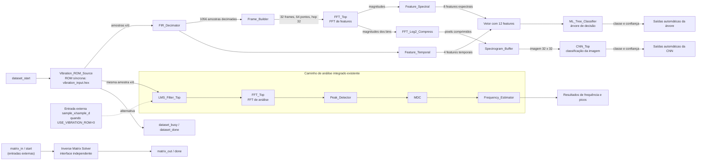

# Arquitetura do `SMMA_Top`

O diagrama mostra os dois caminhos que processam a janela de vibração no modo padrão (`USE_VIBRATION_ROM=1`): o caminho de features/classificação automática e o caminho de análise LMS/FFT já integrado. A inversão de matriz permanece como interface independente.

## Notas de configuração

- `dataset_start` inicia a leitura da ROM; `dataset_busy` e `dataset_done` indicam o estado da janela.
- A ROM fornece os pares `{d, x}` em formato de ponto fixo. A fonte pode usar o divisor de relógio de amostragem ou o modo rápido de simulação.
- `USE_VIBRATION_ROM=0` seleciona o fluxo externo de amostras. `AUTO_CNN_FROM_VIBRATION=0` mantém a interface externa de pixels da CNN.
- A árvore recebe oito features espectrais e quatro temporais. A imagem da CNN é formada a partir das magnitudes da FFT.
- O caminho LMS/FFT/Peak/MDC/Frequency continua em paralelo. A inversão de matriz não é alimentada pelo dataset automaticamente.
